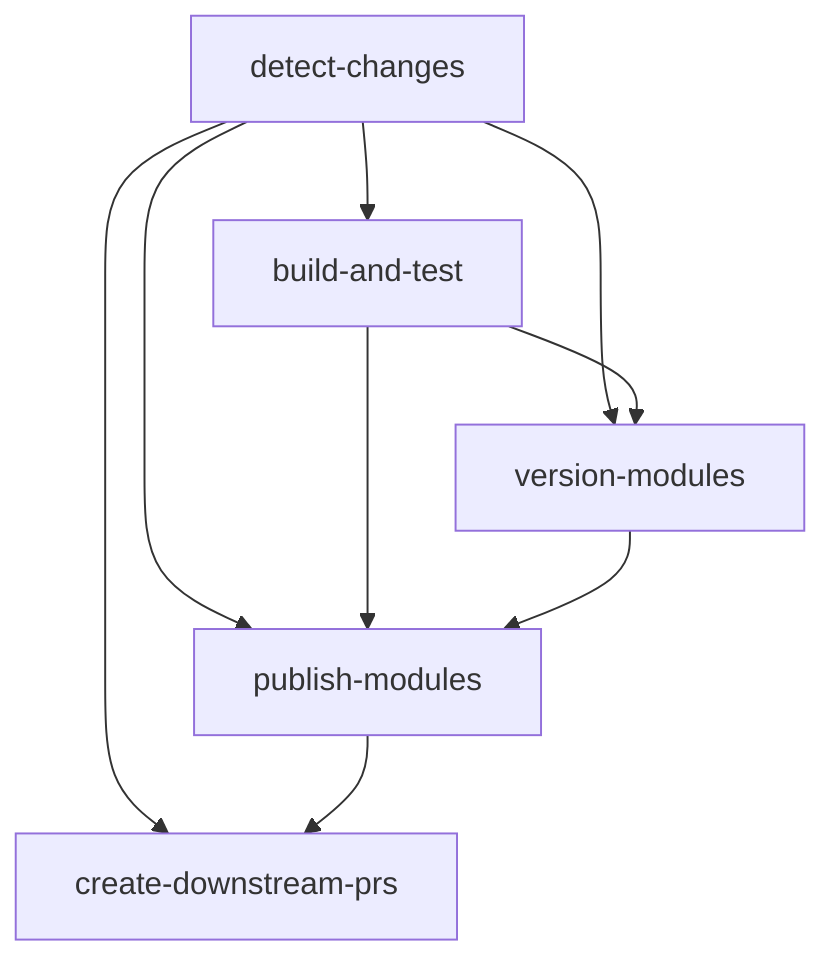

# GitHub Actions Workflow Sequence

Complete guide to how scripts are orchestrated in the CI/CD pipeline for selective versioning and publishing.

## Table of Contents

- [Overview](#overview)
- [Workflow Trigger](#workflow-trigger)
- [Job Sequence](#job-sequence)
- [Script Usage by Job](#script-usage-by-job)
- [Data Flow](#data-flow)
- [Complete Example](#complete-example)
- [Troubleshooting](#troubleshooting)

## Overview

The workflow implements a 5-stage pipeline:

```
┌─────────────────────────────────────────────────────────────────┐
│                    Push to main branch                          │
└──────────────────────┬──────────────────────────────────────────┘
                       │
                       ▼
┌─────────────────────────────────────────────────────────────────┐
│  Stage 1: Detect Changes                                        │
│  ├─ Script: changed-modules.js                                  │
│  └─ Output: List of changed modules                             │
└──────────────────────┬──────────────────────────────────────────┘
                       │
                       ▼
┌─────────────────────────────────────────────────────────────────┐
│  Stage 2: Build & Test                                          │
│  ├─ Script: parallel-build.js (goal: install)                   │
│  ├─ Script: parallel-build.js (goal: test)                      │
│  └─ Parallel execution of changed modules                       │
└──────────────────────┬──────────────────────────────────────────┘
                       │
                       ▼
┌─────────────────────────────────────────────────────────────────┐
│  Stage 3: Version Modules                                       │
│  ├─ pnpm changeset version                                      │
│  ├─ Script: maven-sync.js                                       │
│  └─ Git commit version changes                                  │
└──────────────────────┬──────────────────────────────────────────┘
                       │
                       ▼
┌─────────────────────────────────────────────────────────────────┐
│  Stage 4: Publish to GitHub Packages                            │
│  ├─ Matrix: One job per changed module                          │
│  └─ mvn deploy (per module)                                     │
└──────────────────────┬──────────────────────────────────────────┘
                       │
                       ▼
┌─────────────────────────────────────────────────────────────────┐
│  Stage 5: Create Downstream PRs                                 │
│  ├─ Script: downstream-prs.js                                   │
│  └─ Create PRs in dependent repositories                        │
└─────────────────────────────────────────────────────────────────┘
```

## Workflow Trigger

**File**: `.github/workflows/version-and-publish.yml`

**Trigger Events**:
```yaml
on:
  push:
    branches:
      - main          # Runs full pipeline
  pull_request:
    branches:
      - main          # Runs detect + build only
  workflow_dispatch:  # Manual trigger
```

## Job Sequence

### Job 1: Detect Changes

**Purpose**: Identify which Maven modules have changed

**When**: Always runs on push/PR

**Script**: `changed-modules.js`

**Steps**:
```yaml
- name: Detect changed modules
  id: detect
  run: |
    # Use changed-modules script
    CHANGED=$(node scripts/src/changed-modules.js --csv || echo "")

    if [ -z "$CHANGED" ]; then
      echo "has-changes=false" >> $GITHUB_OUTPUT
      echo "modules=" >> $GITHUB_OUTPUT
      echo "modules-json=[]" >> $GITHUB_OUTPUT
    else
      echo "has-changes=true" >> $GITHUB_OUTPUT
      echo "modules=$CHANGED" >> $GITHUB_OUTPUT

      # Convert CSV to JSON array
      MODULES_JSON=$(echo "$CHANGED" | tr ',' '\n' | jq -R . | jq -sc .)
      echo "modules-json=$MODULES_JSON" >> $GITHUB_OUTPUT
    fi
```

**Outputs**:
```yaml
outputs:
  changed-modules: demo-module-a,demo-module-b
  has-changes: true
  modules-json: ["demo-module-a","demo-module-b"]
```

**Script Behavior**:
- In CI push: Compares `HEAD~1` (previous commit)
- In CI PR: Compares `base...HEAD`
- Returns CSV list of changed module directories

---

### Job 2: Build & Test

**Purpose**: Compile and test changed modules in parallel

**When**: Only if `has-changes == true`

**Scripts**: `parallel-build.js` (2 invocations)

**Dependencies**: Requires Job 1 (detect-changes)

**Steps**:

**Step 2.1: Build Changed Modules**
```yaml
- name: Build changed modules in parallel
  run: |
    MODULES="${{ needs.detect-changes.outputs.changed-modules }}"
    echo "Building modules in parallel: $MODULES"

    # Use parallel-build.js for faster builds
    node scripts/src/parallel-build.js \
      --modules "$MODULES" \
      --max-parallel 4 \
      --goal install
  env:
    GITHUB_TOKEN: ${{ secrets.GITHUB_TOKEN }}
```

**Script Execution**:
```bash
# Actual command executed:
node scripts/src/parallel-build.js \
  --modules "demo-module-a,demo-module-b" \
  --max-parallel 4 \
  --goal install

# Generates Maven commands:
# mvn -pl demo-module-a -am clean install
# mvn -pl demo-module-b -am clean install
```

**Output**:
```
Building 2 module(s) in parallel (max 4 concurrent)
Goal: install
═══════════════════════════════════════════════════

[1/2] Building demo-module-a...
[2/2] Building demo-module-b...

✓ demo-module-a completed (42.3s)
✓ demo-module-b completed (38.1s)

Build Summary: 2 success, 0 failed
Total time: 42.5s
```

**Step 2.2: Test Changed Modules**
```yaml
- name: Test changed modules in parallel
  run: |
    MODULES="${{ needs.detect-changes.outputs.changed-modules }}"

    # Use parallel-build.js for parallel test execution
    node scripts/src/parallel-build.js \
      --modules "$MODULES" \
      --max-parallel 4 \
      --goal test
```

**Script Execution**:
```bash
# Actual command executed:
node scripts/src/parallel-build.js \
  --modules "demo-module-a,demo-module-b" \
  --max-parallel 4 \
  --goal test

# Generates Maven commands:
# mvn -pl demo-module-a test
# mvn -pl demo-module-b test
```

---

### Job 3: Version Modules

**Purpose**: Apply changeset version bumps and sync to Maven

**When**: Only on push to main AND if has-changes

**Scripts**: `maven-sync.js`

**Dependencies**: Requires Jobs 1 & 2

**Steps**:

**Step 3.1: Ensure package.json Exists**
```yaml
- name: Ensure all modules have package.json
  run: pnpm maven:init
```

**Script**: `maven-init.js`
- Creates `package.json` for any module missing it
- Skips modules that already have `package.json`

**Step 3.2: Apply Changesets**
```yaml
- name: Version changed modules
  id: version
  run: |
    MODULES="${{ needs.detect-changes.outputs.changed-modules }}"
    echo "Versioning modules: $MODULES"

    # Apply changesets (if any exist)
    if [ -d ".changeset" ] && [ "$(ls -A .changeset/*.md 2>/dev/null | wc -l)" -gt 0 ]; then
      echo "Applying changesets..."
      pnpm changeset version

      # Sync Maven versions
      pnpm maven:sync

      echo "updated=true" >> $GITHUB_OUTPUT
    else
      echo "No changesets found"
      echo "updated=false" >> $GITHUB_OUTPUT
    fi
```

**What Happens**:

1. **Changeset Version** (`pnpm changeset version`):
   ```bash
   # Reads: .changeset/some-changeset.md
   # Updates: demo-module-a/package.json
   # Before: "version": "0.0.6"
   # After:  "version": "0.0.7"
   # Deletes: .changeset/some-changeset.md
   # Creates: demo-module-a/CHANGELOG.md
   ```

2. **Maven Sync** (`pnpm maven:sync`):
   ```bash
   # Script: maven-sync.js
   # Reads:  demo-module-a/package.json (0.0.7)
   # Updates: demo-module-a/pom.xml
   # Before: <version>0.0.6-SNAPSHOT</version>
   # After:  <version>0.0.7-SNAPSHOT</version>
   ```

**Output**:
```
Syncing Maven and package.json versions...

Processing: demo-module-a
  Maven: 0.0.6-SNAPSHOT
  Package: 0.0.7
  → Updating Maven to 0.0.7-SNAPSHOT
  ✓ Synced (package.json → pom.xml)

Processing: demo-module-b
  Maven: 1.0.0-SNAPSHOT
  Package: 1.0.1
  → Updating Maven to 1.0.1-SNAPSHOT
  ✓ Synced (package.json → pom.xml)
```

**Step 3.3: Commit Version Changes**
```yaml
- name: Commit version changes
  if: steps.version.outputs.updated == 'true'
  run: |
    git add .
    git commit -m "chore: version packages" || echo "No changes to commit"
    git push origin main || echo "No changes to push"
```

**Outputs**:
```yaml
outputs:
  version-updated: true
```

---

### Job 4: Publish Modules

**Purpose**: Deploy changed modules to GitHub Packages

**When**: Only on push to main AND if has-changes

**Scripts**: None (uses Maven directly)

**Dependencies**: Requires Jobs 1, 2, & 3

**Strategy**: Matrix job (one per changed module)

**Steps**:
```yaml
strategy:
  matrix:
    module: ${{ fromJson(needs.detect-changes.outputs.modules-json) }}

steps:
  - name: Publish module to GitHub Packages
    run: |
      echo "Publishing ${{ matrix.module }}..."
      mvn -pl ${{ matrix.module }} -am clean deploy -DskipTests
    env:
      GITHUB_TOKEN: ${{ secrets.GITHUB_TOKEN }}
```

**Execution**:

For 2 modules, creates 2 parallel jobs:

**Job 4.1: Publish demo-module-a**
```bash
mvn -pl demo-module-a -am clean deploy -DskipTests
```

**Job 4.2: Publish demo-module-b**
```bash
mvn -pl demo-module-b -am clean deploy -DskipTests
```

**Output** (per module):
```
[INFO] Installing /path/to/demo-module-a-0.0.7-SNAPSHOT.jar
[INFO] Uploading to github: https://maven.pkg.github.com/...
[INFO] Uploaded to github: ... (1.2 MB at 450 kB/s)
[INFO] BUILD SUCCESS
```

---

### Job 5: Create Downstream PRs

**Purpose**: Create pull requests in dependent repositories

**When**: Only on push to main AND if has-changes

**Scripts**: `downstream-prs.js`

**Dependencies**: Requires Jobs 1 & 4 (publish-modules)

**Steps**:

**Step 5.1: Create Downstream PRs**
```yaml
- name: Create downstream PRs for changed modules
  run: |
    MODULES="${{ needs.detect-changes.outputs.changed-modules }}"
    echo "Creating downstream PRs for: $MODULES"

    # Process each module
    IFS=',' read -ra MODULE_ARRAY <<< "$MODULES"
    for MODULE in "${MODULE_ARRAY[@]}"; do
      echo "Processing downstream PRs for $MODULE..."

      # Get version from package.json
      VERSION=$(cat "$MODULE/package.json" | jq -r '.version')
      echo "  Version: $VERSION"

      # Run downstream PR script
      pnpm -F @libs/scripts downstream:prs \
        --module "$MODULE" \
        --version "${VERSION}-SNAPSHOT"
    done
  env:
    GITHUB_TOKEN: ${{ secrets.PAT_TOKEN || secrets.GITHUB_TOKEN }}
```

**Script Execution**:

For each changed module:

```bash
# Module: demo-module-a
# Version: 0.0.7

node scripts/src/downstream-prs.js \
  --module demo-module-a \
  --version 0.0.7-SNAPSHOT

# Script behavior:
# 1. Reads: demo-module-a/DEPENDENTS.yaml
# 2. Clones: ecruz165/maven-pnpm-monorepo-dependent-repo
# 3. Updates: pom.xml property
# 4. Creates: deps/update-demo-module-a-0.0.7-SNAPSHOT branch
# 5. Pushes: branch to remote
# 6. Creates: Pull request via GitHub API
```

**Output**:
```
Creating downstream PRs for demo-module-a v0.0.7-SNAPSHOT

Found 1 dependent(s)

Processing dependent: ecruz165/maven-pnpm-monorepo-dependent-repo
  Cloning repository https://github.com/ecruz165/maven-pnpm-monorepo-dependent-repo.git
  ✓ Modified pom.xml
  ✓ Pushed branch deps/update-demo-module-a-0.0.7-SNAPSHOT
  ✓ Created PR #2: https://github.com/ecruz165/maven-pnpm-monorepo-dependent-repo/pull/2

============================================================
Summary: 1 successful, 0 failed
============================================================
```

**Created Pull Request**:

**Title**: `chore(deps): update demo-module-a to 0.0.7-SNAPSHOT`

**Changes**:
```diff
diff --git a/pom.xml b/pom.xml
--- a/pom.xml
+++ b/pom.xml
@@ -14,7 +14,7 @@
     <properties>
-        <demo-module-a.version>0.0.6-SNAPSHOT</demo-module-a.version>
+        <demo-module-a.version>0.0.7-SNAPSHOT</demo-module-a.version>
     </properties>
```

---

## Data Flow

### Job Dependencies



### Data Passed Between Jobs

**detect-changes → build-and-test**:
```yaml
needs.detect-changes.outputs.changed-modules
# Value: "demo-module-a,demo-module-b"
```

**detect-changes → version-modules**:
```yaml
needs.detect-changes.outputs.changed-modules
# Value: "demo-module-a,demo-module-b"
```

**detect-changes → publish-modules**:
```yaml
needs.detect-changes.outputs.modules-json
# Value: ["demo-module-a","demo-module-b"]
# Used in: strategy.matrix.module
```

**version-modules → publish-modules**:
```yaml
needs.version-modules.outputs.version-updated
# Value: true/false
# Implicit dependency: Waits for version commit
```

**publish-modules → create-downstream-prs**:
```yaml
# Implicit dependency: Ensures modules published before PR creation
```

---

## Complete Example

### Scenario: Developer pushes change to demo-module-a

**Step 1: Developer Actions**
```bash
# 1. Make changes to demo-module-a
vim demo-module-a/src/main/java/com/example/DemoClass.java

# 2. Create changeset
pnpm changeset
# → Select: @libs/demo-module-a
# → Type: patch
# → Summary: Add new feature

# 3. Commit and push
git add .
git commit -m "feat: add new feature to demo-module-a"
git push origin main
```

**Step 2: GitHub Actions Triggered**

**Job 1: Detect Changes** ⏱️ ~5s
```
changed-modules.js detects:
  Files changed: demo-module-a/src/main/java/com/example/DemoClass.java
  Modules affected: demo-module-a
  Output: demo-module-a
```

**Job 2: Build & Test** ⏱️ ~45s
```
parallel-build.js (install):
  mvn -pl demo-module-a -am clean install
  ✓ demo-module-a completed (42.3s)

parallel-build.js (test):
  mvn -pl demo-module-a test
  ✓ demo-module-a completed (8.7s)
```

**Job 3: Version Modules** ⏱️ ~15s
```
pnpm changeset version:
  demo-module-a/package.json: 0.0.6 → 0.0.7
  .changeset/some-changeset.md: deleted
  demo-module-a/CHANGELOG.md: updated

maven-sync.js:
  demo-module-a/pom.xml: 0.0.6-SNAPSHOT → 0.0.7-SNAPSHOT

git commit:
  Committed: "chore: version packages"
  Pushed to main
```

**Job 4: Publish Modules** ⏱️ ~30s
```
mvn deploy (demo-module-a):
  Uploading: demo-module-a-0.0.7-SNAPSHOT.jar
  Published to: GitHub Packages
  ✓ Success
```

**Job 5: Create Downstream PRs** ⏱️ ~10s
```
downstream-prs.js:
  Module: demo-module-a
  Version: 0.0.7-SNAPSHOT

  Reading: demo-module-a/DEPENDENTS.yaml
  Found: ecruz165/maven-pnpm-monorepo-dependent-repo

  Cloning: dependent repository
  Updating: pom.xml property
  Committing: "chore(deps): update demo-module-a to 0.0.7-SNAPSHOT"
  Pushing: deps/update-demo-module-a-0.0.7-SNAPSHOT
  Creating: Pull Request #2

  ✓ PR Created: https://github.com/.../pull/2
```

**Total Workflow Time**: ~105 seconds (1m 45s)

---

## Conditional Execution

### When Jobs Run

| Job | push to main | pull_request | Conditions |
|-----|-------------|--------------|------------|
| detect-changes | ✅ Always | ✅ Always | None |
| build-and-test | ✅ If changes | ✅ If changes | `has-changes == true` |
| version-modules | ✅ If changes | ❌ Never | `has-changes == true` AND `push` |
| publish-modules | ✅ If changes | ❌ Never | `has-changes == true` AND `push` |
| create-downstream-prs | ✅ If changes | ❌ Never | `has-changes == true` AND `push` |

### Early Exit Scenarios

**Scenario 1: No changes detected**
```
Job 1: detect-changes ✓
  Output: has-changes=false

Job 2-5: Skipped (condition not met)

Workflow Result: ✓ Success (no work needed)
```

**Scenario 2: Pull request**
```
Job 1: detect-changes ✓
Job 2: build-and-test ✓

Job 3-5: Skipped (not push to main)

Workflow Result: ✓ Success (validation only)
```

**Scenario 3: Push without changesets**
```
Job 1: detect-changes ✓
Job 2: build-and-test ✓
Job 3: version-modules ✓
  Output: version-updated=false (no changesets found)

Job 4: publish-modules ⏭️ Runs but no version change
Job 5: create-downstream-prs ✓ Uses existing version

Workflow Result: ✓ Success (no version bump)
```

---

## Environment Variables

### Required in Workflow

| Variable | Scope | Purpose |
|----------|-------|---------|
| `GITHUB_TOKEN` | Auto-provided | Repository access, Maven deploy |
| `PAT_TOKEN` | Secret | Cross-repository PR creation |

### Used by Scripts

| Variable | Script | Purpose |
|----------|--------|---------|
| `CI` | changed-modules.js | Detect CI environment |
| `GITHUB_EVENT_NAME` | changed-modules.js | Determine git diff strategy |
| `GITHUB_TOKEN` | downstream-prs.js | GitHub API authentication |

---

## Troubleshooting

### Issue: Jobs skipped unexpectedly

**Check**:
```yaml
# View job conditions
needs.detect-changes.outputs.has-changes
github.event_name
github.ref
```

**Debug**:
```bash
# Local test
node scripts/src/changed-modules.js
# Should output changed modules
```

---

### Issue: Version not applied

**Check**:
1. Changesets exist: `ls .changeset/*.md`
2. Version job output: `needs.version-modules.outputs.version-updated`
3. Maven sync logs

**Debug**:
```bash
# Local test
pnpm changeset version
pnpm maven:sync
pnpm maven:status
```

---

### Issue: Downstream PR creation fails

**Check**:
1. PAT_TOKEN configured
2. DEPENDENTS.yaml exists
3. Token has `repo` scope

**Debug**:
```bash
# Local test
export GITHUB_TOKEN=your_pat_here
node scripts/src/downstream-prs.js \
  --module demo-module-a \
  --version 0.0.7-SNAPSHOT \
  --dry-run
```

---

## Related Documentation

- [PAT Setup](.github/PAT_SETUP.md) - GitHub token configuration
- [Scripts Overview](../scripts/README.md) - All script documentation
- [Workflow File](.github/workflows/version-and-publish.yml) - Actual workflow

---

## Summary

The workflow orchestrates 6 scripts across 5 jobs:

| Job | Scripts Used | Purpose |
|-----|-------------|---------|
| 1. detect-changes | changed-modules.js | Find affected modules |
| 2. build-and-test | parallel-build.js (×2) | Build & test in parallel |
| 3. version-modules | maven-init.js, maven-sync.js | Apply version bumps |
| 4. publish-modules | (Maven only) | Deploy to GitHub Packages |
| 5. create-downstream-prs | downstream-prs.js | Update dependent repos |

**Total automation**: From code change → version bump → publish → downstream PRs in ~2 minutes.
