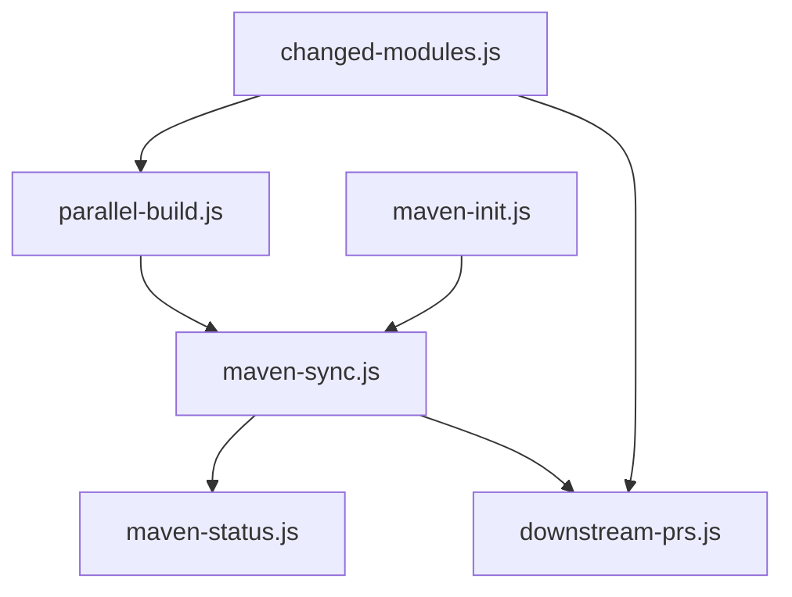

# Maven-pNPM Monorepo Scripts

Automation scripts for managing a Maven monorepo with pnpm workspace integration and selective versioning.

## Overview

This directory contains Node.js scripts that bridge Maven and pnpm ecosystems, enabling:

- **Selective Versioning**: Independent version management per module
- **Change Detection**: Git-based module change detection
- **Parallel Builds**: Concurrent Maven builds with dependency resolution
- **Version Synchronization**: Bidirectional sync between Maven and package.json
- **Downstream Automation**: Automatic PR creation in dependent repositories

## Scripts

### Core Scripts

| Script | Purpose | Documentation |
|--------|---------|---------------|
| [changed-modules.js](docs/README-changed-modules.md) | Detect which Maven modules changed | [Docs](docs/README-changed-modules.md) |
| [parallel-build.js](docs/README-parallel-build.md) | Build multiple modules concurrently | [Docs](docs/README-parallel-build.md) |
| [downstream-prs.js](docs/README-downstream-prs.md) | Create PRs in dependent repositories | [Docs](docs/README-downstream-prs.md) |

### Synchronization Scripts

| Script | Purpose | Documentation |
|--------|---------|---------------|
| [maven-init.js](docs/README-maven-init.md) | Initialize package.json for Maven modules | [Docs](docs/README-maven-init.md) |
| [maven-sync.js](docs/README-maven-sync.md) | Sync versions between Maven and pnpm | [Docs](docs/README-maven-sync.md) |
| [maven-status.js](docs/README-maven-status.md) | Check version synchronization status | [Docs](docs/README-maven-status.md) |

## Quick Start

### Installation

```bash
# Install dependencies
pnpm install
```

### Common Workflows

#### 1. Initial Setup

```bash
# Initialize package.json for all modules
pnpm maven:init

# Verify synchronization
pnpm maven:status
```

#### 2. Development Workflow

```bash
# Detect changed modules
pnpm changed:modules

# Build changed modules in parallel
CHANGED=$(pnpm changed:modules --csv)
node scripts/src/parallel-build.js --modules "$CHANGED"
```

#### 3. Version Bump Workflow

```bash
# Create changeset
pnpm changeset

# Apply version bumps
pnpm changeset version

# Sync Maven versions
pnpm maven:sync

# Verify
pnpm maven:status
```

#### 4. Publishing Workflow

```bash
# Build and deploy
pnpm maven:sync
mvn clean deploy -pl <module>

# Create downstream PRs
node scripts/src/downstream-prs.js \
  --module <module> \
  --version <version>-SNAPSHOT
```

## Available pnpm Scripts

### Change Detection

```bash
pnpm changed:modules          # Detect changed modules
pnpm changed:modules:csv      # Output as CSV
```

### Maven Synchronization

```bash
pnpm maven:init              # Initialize package.json files
pnpm maven:sync              # Sync Maven ↔ package.json versions
pnpm maven:status            # Check synchronization status
```

### Building

```bash
pnpm build:parallel          # Build changed modules in parallel
pnpm test:parallel           # Test changed modules in parallel
```

### Downstream Automation

```bash
pnpm downstream:prs          # Create downstream PRs (requires env vars)
```

## Script Dependencies



## Workflow Integration

### CI/CD Pipeline

```yaml
# .github/workflows/version-and-publish.yml
jobs:
  detect-changes:
    - run: node scripts/src/changed-modules.js --csv

  build-and-test:
    - run: node scripts/src/parallel-build.js --modules "$MODULES"

  version-modules:
    - run: pnpm changeset version
    - run: pnpm maven:sync

  publish-modules:
    - run: mvn deploy -pl <module>

  create-downstream-prs:
    - run: node scripts/src/downstream-prs.js --module <module> --version <version>
```

### Local Development

```bash
# Pre-commit hook
pnpm maven:status
pnpm maven:sync

# Before PR
pnpm changed:modules
pnpm build:parallel
pnpm test:parallel
```

## Environment Variables

| Variable | Required | Used By | Description |
|----------|----------|---------|-------------|
| `GITHUB_TOKEN` | Yes* | downstream-prs.js | GitHub PAT for cross-repo PRs |
| `CI` | Auto | changed-modules.js | Enables CI-specific behavior |
| `GITHUB_EVENT_NAME` | Auto | changed-modules.js | GitHub event type detection |
| `MAVEN_OPTS` | No | parallel-build.js | JVM options for Maven |

\* Required for downstream PR creation

## Configuration Files

### Module Configuration

Each module should have:

- **pom.xml** - Maven project descriptor
- **package.json** - npm package descriptor (created by maven-init.js)
- **DEPENDENTS.yaml** - Downstream repository configuration (optional)

### Repository Configuration

- **pnpm-workspace.yaml** - pnpm workspace configuration
- **package.json** - Root package.json with workspace definitions
- **.github/workflows/** - CI/CD workflows

## Architecture

### Maven ↔ pnpm Bridge

```
Maven Ecosystem          Bridge Scripts         pnpm Ecosystem
─────────────────        ──────────────         ──────────────
pom.xml                  maven-sync.js          package.json
  ├─ groupId        ─────────────────────►         ├─ @libs/<name>
  ├─ artifactId     ◄─────────────────────         ├─ version
  ├─ version                                       └─ maven metadata
  └─ packaging

mvn commands             parallel-build.js      pnpm scripts
  ├─ clean          ─────────────────────►         ├─ build
  ├─ package        ◄─────────────────────         ├─ test
  └─ deploy                                        └─ deploy
```

### Change Detection Flow

```
Git Diff → changed-modules.js → Module List → parallel-build.js → Maven Build
                                           ↓
                                    downstream-prs.js → GitHub PRs
```

### Version Sync Flow

```
Changeset → package.json bump → maven-sync.js → pom.xml update → Maven Build
                                                              ↓
                                                         GitHub Publish
```

## Troubleshooting

### Common Issues

**Issue**: Versions out of sync

**Solution**:
```bash
pnpm maven:status
pnpm maven:sync
```

---

**Issue**: No modules detected

**Solution**:
```bash
# Ensure modules have package.json
pnpm maven:init

# Check git status
git status
```

---

**Issue**: Downstream PR fails with 403

**Solution**:
- Create PAT with `repo` scope
- Add to repository secrets as `PAT_TOKEN`
- See `.github/PAT_SETUP.md`

---

**Issue**: Parallel build fails

**Solution**:
```bash
# Build sequentially for debugging
node scripts/src/parallel-build.js \
  --modules "demo-module-a" \
  --max-parallel 1
```

## Performance Tips

1. **Use parallel builds**: ~2-3x faster than sequential
2. **Skip tests in CI**: Use `--skip-tests` for faster builds
3. **Limit concurrency**: Set `--max-parallel` based on available RAM
4. **Cache Maven dependencies**: Use `actions/setup-java@v4` with caching

## Development

### Adding New Scripts

1. Create script in `scripts/src/`
2. Add executable permissions: `chmod +x scripts/src/<script>.js`
3. Add pnpm script in `scripts/package.json`
4. Create documentation: `scripts/src/README-<script>.md`
5. Update this README

### Testing Scripts

```bash
# Run locally
node scripts/src/<script>.js --help

# Via pnpm
pnpm <script-name>

# In CI (dry-run)
node scripts/src/<script>.js --dry-run
```

## License

See root LICENSE file.

## Contributing

1. Follow existing script patterns
2. Add comprehensive documentation
3. Include error handling
4. Test in both CI and local environments
5. Update this README

## Support

For issues or questions:
1. Check individual script documentation
2. Review workflow logs in GitHub Actions
3. Search existing issues
4. Create new issue with reproduction steps
